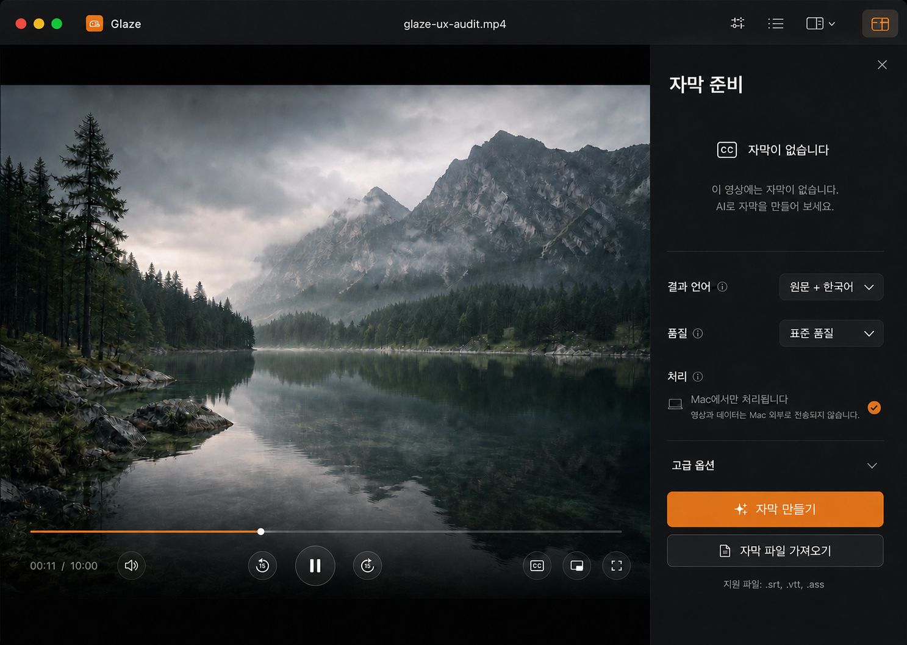

# 승인된 macOS 플레이어 UI

확정일: 2026-08-11

상태: 시각 디자인 승인, SwiftUI 구현 대기

Figma: [Approved / macOS Player UI](https://www.figma.com/design/p1Y9SkEuKnXdfMHWBiSmRa?node-id=41-17)

## 소스 오브 트루스

- 위 이미지와 Figma `Approved / macOS Player UI` 페이지가 macOS 플레이어의 시각 기준이다.
- Figma `Architecture / Cross-platform Player` 페이지는 플랫폼 구조와 상태 계약 참고용이며 시각적 최종안이 아니다.
- 구현 과정에서 컴포넌트 크기나 간격이 불명확하면 원본 이미지의 상대적 위계와 영상 가림 최소화를 우선한다.
- 구현 전 임의의 대형 Glass bar, 좌·우 캡슐, 별도 카드형 컨트롤 영역으로 재해석하지 않는다.

## Player contract

- 영상은 edge-to-edge 주 콘텐츠로 유지한다.
- 타임라인은 컨테이너 없는 얇은 track과 scrubber로 표시한다.
- 좌측에는 시간과 개별 원형 볼륨 버튼을 둔다.
- 중앙에는 15초 뒤로, 재생·일시정지, 15초 앞으로를 개별 원형 버튼으로 둔다. 재생 버튼만 한 단계 크게 표시한다.
- 우측에는 CC, PiP, 전체 화면을 개별 원형 버튼으로 둔다.
- 각 버튼은 clear Liquid Glass 또는 반투명 material을 사용하되 하나의 캡슐로 합쳐 보이지 않게 한다.
- 컨트롤은 재생 중 비활동 시 물러나고 포인터 이동, Space 입력, 일시정지 시 복귀한다.

## Inspector contract

- macOS trailing Inspector 폭은 380–420pt 범위로 둔다.
- 툴바 trailing 토글이 Inspector를 열고 닫으며 선택 상태는 브랜드 앰버로 강조한다.
- 자막 없음 상태는 분명하지만 방해되지 않게 표시한다.
- 결과 언어, 품질, 처리 상태는 `Form`/`Section`/`LabeledContent`/`Menu` 기반으로 구성한다.
- `자막 만들기`는 전체 폭 primary action, `자막 파일 가져오기`는 전체 폭 secondary action으로 유지한다.
- CTA 아이콘은 14–16pt로 제한하고 라벨보다 시각적으로 앞서지 않게 한다.
- 자막 생성은 사용자가 primary action을 명시적으로 선택한 뒤에만 시작한다.

## Localization contract

- 초기 UI 언어는 한국어와 영어이며 미지원 시스템 언어는 영어로 fallback한다.
- 언어·품질 내부 값은 locale 독립 식별자로 유지하고 표시 문자열만 번역한다.
- 라벨 열을 고정 폭으로 만들지 않고 문자열 40% 확장을 허용한다.
- 말줄임표보다 줄바꿈, 컨테이너 확장, Inspector 폭 조정을 우선한다.
- CJK의 짧은 문자열과 라틴계 언어의 긴 문자열을 모두 검증한다.
- RTL에서는 의미 구조를 미러링하되 미디어 시간축과 시간 표기의 진행 방향은 플레이어 관례를 유지한다.
- production 타입은 SF Pro / SF Pro Rounded, 아이콘은 SF Symbols를 사용한다. Figma 설명 영역의 Inter는 문서용이며 앱 타입 기준이 아니다.

## 구현 수용 기준

- 승인 원본의 native size인 1487 × 1058 기준에서 컨트롤 위치·위계·영상 가림 정도가 일치한다.
- 밝은 영상에서도 버튼과 timeline이 식별되며 전체 화면을 덮는 dim layer를 사용하지 않는다.
- Reduce Transparency에서 regular material 대체가 동작한다.
- 한국어·영어와 40% 확장 테스트 문자열에서 Inspector label, Menu, CTA가 잘리거나 겹치지 않는다.
- 키보드, VoiceOver, 포인터 hover, tooltip, 전체 화면, CC, PiP가 각 플랫폼 관례대로 동작한다.
